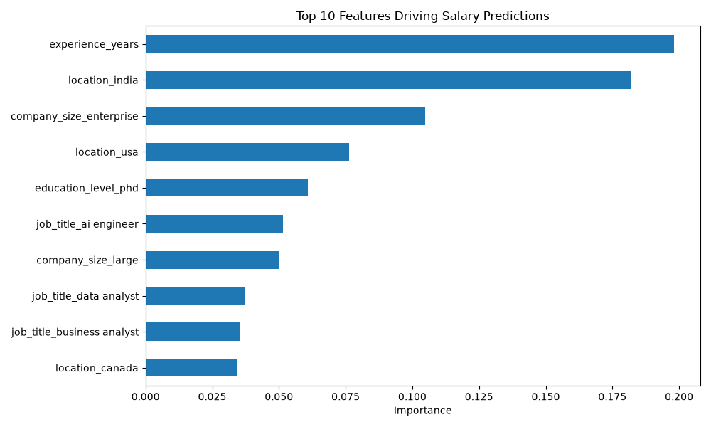

# Data Analyst Salary Estimator

An interactive Python web app that predicts salary ranges using a trained machine learning model, based on job title, experience, education, skills, industry, company size, location, remote work status, and certifications.

## Live Demo
[https://data-analyst-salary-estimator-v2-w5m7nke4qyfqifjcykeay3.streamlit.app/]

## Overview
This project uses a Random Forest Regression model trained on a 250,000-record dataset to predict salary based on 9 input features. It includes data cleaning, exploratory analysis, model training/evaluation, and a deployed interactive Streamlit interface.

## Model Performance
- **Mean Absolute Error:** $5,018.93
- **R² Score:** 0.9712

## Top Predictive Features


Years of experience, location, and company size were the strongest predictors of salary in this dataset.

## Tech Stack
- Python, pandas, scikit-learn (Random Forest Regression)
- Streamlit (interactive web app)
- Jupyter Notebook (EDA and model training)

## How to Run Locally
```bash
git clone https://github.com/mmarksjones-creator/data-analyst-salary-estimator-v2.git
cd data-analyst-salary-estimator-v2
pip install -r requirements.txt
```
Then open `eda.ipynb` and run all cells to train and save the model (`salary_model.pkl` is excluded from the repo due to file size). Once trained, run:
```bash
streamlit run app.py
```

## Dataset Note
This project uses a synthetic dataset (Kaggle: "Job Salary Prediction Dataset") generated for analytical practice. Salary values are sample data, not real-world market figures — this project demonstrates the end-to-end ML workflow (data cleaning, EDA, model training, evaluation, and deployment), not real-world salary accuracy.
